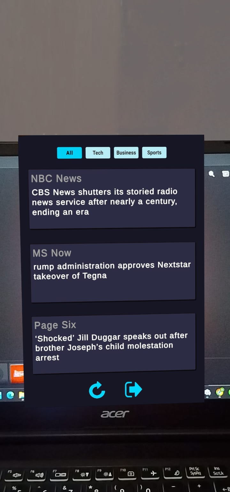
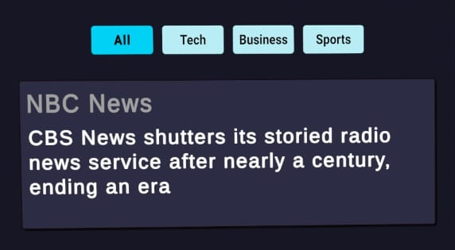

# GlanceAR
 
## AR news reader built with Unity and Vuforia
 
> A mobile AR app that shows real-time news headlines when you scan a target image. Built as a final submission task during a 4-week college AR/VR training program.
 
---
 
## Why We Built This
 
At the end of a 4-week AR/VR training program at our college, our team was given a final submission task: build a working AR application that goes beyond the usual "scan and see a 3D model" demos. We were asked to come up with something practical, so we landed on an AR news reader — a real use case that felt relevant and achievable within the scope of the program.
 
As part of the team, I focused on designing the UI, planning the user flow, and testing to make sure everything worked smoothly.
 
---
 
## What It Does
 
- Scan a target image with your phone camera to activate the AR experience
- Displays 3 news headlines with source and timestamp
- Filter news by category: All, Tech, Business, or Sports
- Refresh button to get the latest headlines
- Smooth splash screen animation on startup
 
---
 
## Demo

### Screenshots

<p align="center">
  <table>
    <tr>
      <td align="center">
        <br>
        <sub><b>Splash Screen</b> — App startup animation</sub>
      </td>
      <td align="center">
        <br>
        <sub><b>AR View</b> — Live news headlines overlaid on the target image</sub>
      </td>
    </tr>
    <tr>
      <td align="center" colspan="2">
        <br>
        <sub><b>Category Filters</b> — Switch between All, Tech, Business, and Sports</sub>
      </td>
    </tr>
  </table>
</p>

### Working demo

<p align="center">
  <a href="docs/demovid.mp4">
    <br>
    <sub>▶ Click to watch the demo</sub>
  </a>
</p>

---
 
## Tech Stack
 
| What | Technology |
|---|---|
| **Game Engine** | Unity 6.0 |
| **AR Framework** | Vuforia SDK 11.4.4 |
| **Language** | C# |
| **API** | NewsAPI |
| **Platform** | Android |
 
---

## Project Files

```
glanceAR/
├── Assets/
│   ├── Scenes/
│   │   └── MainScene.unity            # Main AR + splash scene
│   ├── Scripts/
│   │   ├── NewsAPIHandler.cs          # Fetches headlines from NewsAPI
│   │   ├── NewsDisplay.cs             # Renders news cards in AR
│   │   ├── CategoryManager.cs         # Category filter logic
│   │   ├── SplashAnimator.cs          # Splash screen animation
│   │   ├── SplashManager.cs           # Splash lifecycle control
│   │   ├── ContentAnimator.cs         # Card animation effects
│   │   ├── ButtonPressEffect.cs       # Button press feedback
│   │   ├── RefreshButtonController.cs # Refresh button handling
│   │   ├── SpinnerRotate.cs           # Loading spinner
│   │   └── ExitApp.cs                 # App exit handling
│   ├── Images/                        # UI icons and assets
│   ├── Resources/                     # Vuforia configuration
│   └── StreamingAssets/Vuforia/       # AR target database
├── Packages/                          # Unity package manifest
├── ProjectSettings/                   # Build and player settings
├── docs/                              # README screenshots
└── README.md
```

---
 
## How to Run This

### You'll Need
- Unity Hub with Unity 6.0
- An Android phone with USB debugging enabled
- A free NewsAPI key from [newsapi.org](https://newsapi.org)
- A free Vuforia license key from [developer.vuforia.com](https://developer.vuforia.com)

### Setup

```bash
git clone https://github.com/harsh-space/glanceAR.git
```

1. Open **Unity Hub** → **Add project from disk** → select the `glanceAR` folder
2. Open the project — Unity will auto-import packages from `Packages/manifest.json`
3. Open `Assets/Scenes/MainScene.unity`

**Add your NewsAPI key:**
- In the Hierarchy, select the GameObject that has `NewsAPIHandler` attached
- In the Inspector, paste your key into the **Api Key** field

**Add your Vuforia license key:**
- Go to **Window → Vuforia Configuration**
- Paste your key into the **App License Key** field

**Build for Android:**
- File → Build Settings → Switch Platform to **Android** → Build and Run
- Connect your phone via USB with USB debugging enabled

**Target image:** The AR database is already included — no setup needed. Just print or display this image to trigger the AR view:

<p align="center">
  <br>
  <sub>Point your phone camera at this image to activate the AR experience</sub>
</p>
 
---

## My Role in This Project

Within the team, I contributed across two areas:

**UI Design & User Flow**
- Designed the news card layout and category filter buttons
- Defined the end-to-end user flow from splash screen to AR view, focusing on clarity and minimal interactions

**QA & Testing**
- Tested edge cases including no internet, slow connections, and varying AR tracking distances
- Identified and helped resolve issues with data rendering and UI state updates

---

## Challenges I Faced
 
**Cards drifting from the target**  
The news cards weren't staying in place. Found out I had attached them to the wrong parent object. Moving them to the ImageTarget fixed it.
 
**Category buttons not updating content**  
The app was fetching new data but not showing it on screen. Separated the data fetching code from the UI update code, which made debugging much easier.

---

## What I'd Improve
 
- **Error messages** — Currently nothing shows if the API fails. Would add friendly error messages.
- **Better code organization** — Would split the code into separate files for API calls, UI updates, and AR management.
- **Offline mode** — Would cache headlines so the app works without internet.
- **Multiple targets** — Would make different images trigger different news categories.
- **Loading indicator** — Would add a spinner while fetching news instead of just freezing.
 
---